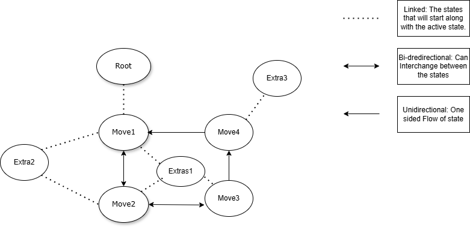
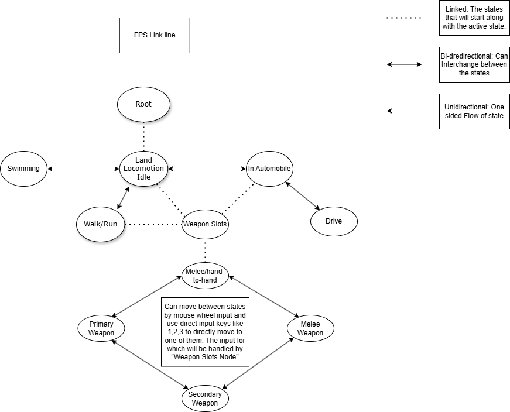
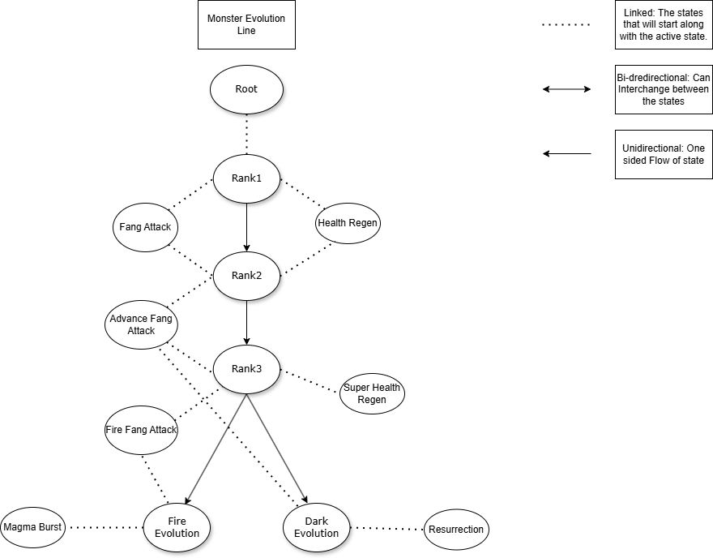
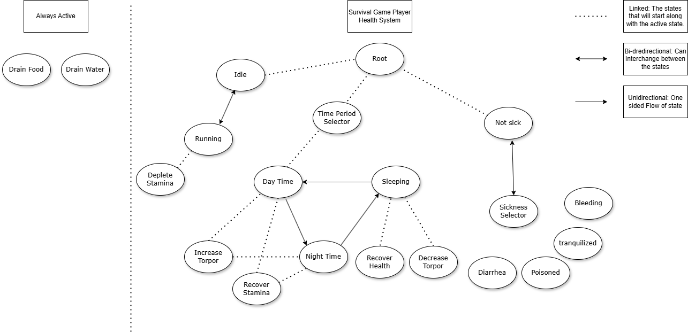

## Note: This project is still in the experimental phase and has not been tested for all possible cases. It may cause problems or fail.
# Linked State Machine
## Description:
The Linked State Machine is a variation of the traditional state machine designed to address the common issue of running multiple states simultaneously. A standard state machine operates by executing one state at a time. However, in scenarios where multiple states need to run concurrently, there is no straightforward way to achieve this without creating multiple state machines. Even then, synchronizing these state machines can be challenging. To address this, the Linked State Machine was developed.

## How it works?
The Linked State Machine operates similarly to a tree or graph data structure, combining elements of both. It features a basic tree-like structure but resembles a graph in its overall organization. Like a tree's root and leaf nodes, it consists of a Linked State root node and Linked State nodes. Similar to traditional state machines, where each state can decide whether to transition to the next state, Linked States also have this capability. However, the actual transition process relies on the parent node, acting as the state machine node, to manage these transitions. This parent node receives transition requests from its child Linked State nodes, closes the current state, detaches it, starts the next state, and then attaches it. The key feature is that each leaf node can be linked to multiple leaf nodes, which in turn can be linked to additional leaf nodes. Each Linked State has a "Linked State" property, which includes states linked to it and activated as soon as it starts. This operation can be likened to how a tree data structure functions, with the added complexity of a graph.

## Thorough Explanation of Working if needed:
The Linked State root acts as the main root node, similar to a tree root. It starts its linked states, which can be one or multiple states. Further states will start their own linked states, and this process repeats until all linked states are started. Once the tree is constructed, all states begin working and performing their isolated tasks. Linked States are not capable of directly transitioning to the next state(s) by themselves. Instead, if they want to transition, they send a transition request to the state that started them. This parent state then decides whether to allow the transition. It is responsible for closing the entire branch of the sender state and starting the next states. While sending the transition request, the receiving state can also choose to send the request further up the link. The request can travel up the tree until a node decides to stop and close the whole branch associated with the signal or until it reaches the root node, which does not propagate the signal further and only performs the transition. If a state has a linked state that is already active, the states prioritize transferring states instead of closing them for efficiency. Additionally, there is an option to select "is always active" for Linked States, which makes them act like a Linked State root node with capabilities similar to a State (including functionalities such as Enter, Exit, Update, and StateInput, which are not part of the Linekd State Root Node).

## Some Use Case Examples:
These examples are theoretical and not yet tested. They demonstrate potential applications of the Linked State Machine.

### General Use Case:

### FPS Game Example:

### Monster Evolution Line:

### Survival Game Stat System:

## How to use it?
Currently, there is no comprehensive documentation on how to use the Linked State Machine. However, I will add comments wherever necessary to make the functionality more understandable. If you encounter any confusion or missing comments, please raise an issue, and I will provide explanations and update the comments accordingly. Additional explanations can also be found in the Engine documentation, which includes a description panel for each declared class.

## What the project already includes?
The project comes with a simple example scene to demonstrate how to create a weapon slot/weapon selection system from the FPS Example diagram, which is designed in a more general sense. It also includes a Linked State Tree printer, which is a scene that can be used to print the currently active tree for better visualization of what is happening.
